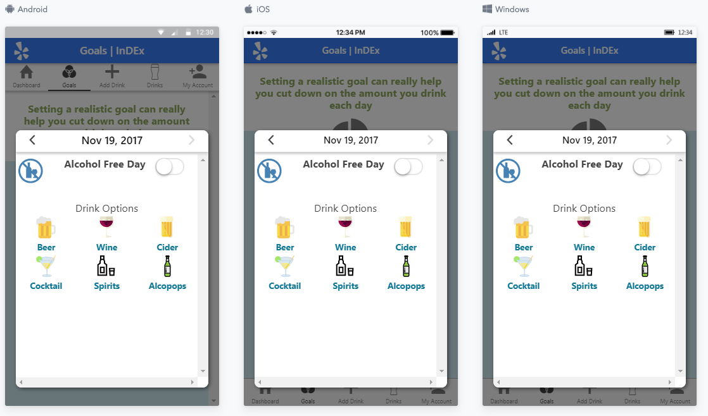

# InDEx App - Public Release (v1.0.0)

InDEx is a software package for reporting and monitoring alcohol consumption via a smartphone application. Consumption of alcohol is self-reported by the user, with the app providing a visual representation of drinking behaviour and consumption levels compared to the general population. The app was developed by [Dr Daniel Leightley](https://www.leightley.com) of the [King's Centre for Military Health Research](https://www.kcl.ac.uk/kcmhr/index.aspx) funded by a [Medical Research Council](https://www.mrc.ac.uk/) Grant led by [Dr Laura Goodwin](https://www.liverpool.ac.uk/psychology-health-and-society/staff/laura-goodwin/) and [Professor Nicola Fear](https://kclpure.kcl.ac.uk/portal/nicola.t.fear.html).

## Table of Contents

- [License](#license)
- [Publication](#publication)
- [Getting Started](#getting-started)
- [App Preview](#app-preview)
- [Deploying](#deploying)
- [Misc](#misc)
- [-Obfuscate](#obfuscate)
- [-RESTful API](#restful-api)
- [-Other Publications](#other-publications)
- [-Future Work](#future-work)
- [-SVG Images](#svg-images)

## License

The InDEx app has been released under [GNU General Public License (v3)](https://www.gnu.org/licenses/gpl-3.0.en.html) license to promote open source app development and sharing of innovation within the research community. Simply, use freely but make your software accessible to others.

## Publication

You can cite this software using the following reference:

```
Leightley, D., Puddephatt, J., Goodwin, L., Roberto, R., Fear, N. T., (2017). InDEx: Open source iOS and Android software for self-reporting and monitoring of alcohol consumption. Journal of Open Research Software X(X), p.X. DOI: X
```
NOTE: Manuscript currently under review.

## Getting Started

* [Download the installer](https://nodejs.org/) for Node.js.
* Install the ionic CLI globally: `npm install -g ionic` (life saver)
* Clone this repository: `git clone https://github.com/DrDanL/index-app-public.git`.
* Run `npm install` from the project root.
* Run `ionic serve` in a terminal from the project root.
* Enjoy. :beers:

_Note: You may need to add “sudo” in front of any global commands to install the utilities._

## App Preview

[Try it live](https://drdanl.github.io/index-app-public/www)

All app preview screenshots were taken by running `ionic serve --l`.

- Add Drinks Page

  

- Dashboard Page

  

- To see more images of the app, check out the [screenshots directory](https://github.com/DrDanL/index-app-public/tree/master/resources/screenshots)!

## Deploying

* PWA - run `npm run ionic:build --prod` and then push the `www` folder to your favorite hosting service
* Android - Run `ionic cordova run android --prod`
* iOS - Run `ionic cordova run ios --prod`

## Misc.

### Obfuscate

Whilst building InDEx with Ionic, it was great to have code separated out into separate files with plenty of white space to increase readability and rapid detection of errors. However, when submitting the application to iOS or Android App Stores it is important that the project source code is obfuscated. Currently this has not been implemented and all code has been separated (see /www/index.html for an example). However, cordovda-uglify is setup for the task.

### RESTful API

The InDEx app was built upon a RESTful API service (info graphic [here]( https://www.leightley.com/content/images/2017/02/infographic_mrc_v2.png)). However, due the API being tightly coupled to the King’s Centre for Military Health Research network we have chosen to release the InDEx app as a standalone application. It is very easy to implement a RESTful API within the platform. Future releases of InDEx will also include the backend API.

### Other Publications

This section will be updated with references to publications based on the InDEx app.

### Future Work

The app is currently under active development for v2.0.0, the codebase is due for release post testing in early 2019. If you are interested in finding out more, before this time, please contact [Dr Daniel Leightley](https://www.leightley.com/contact-daniel/).

### SVG Images

All SVG icons have been sourced from [FlatIcon](https://www.flaticon.com/).
